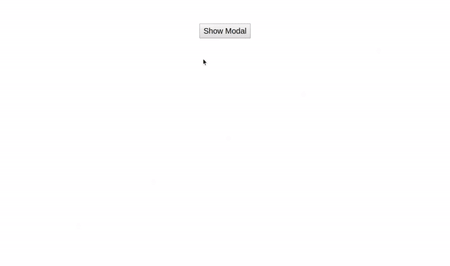

# AngularJS - MessageDialog Component

AngularJS based MessageDialog component used for showing custom dialog with message. You can even change number of buttons on that. You can also hide header and cross icon.

## Table of contents

- [Browser Support](#browser-support)
- [Demo](#demo)
- [Getting started](#getting-started)
- [Usage](#usage)
- [Available Props](#available-props)
- [Methods](#methods)
- [Want to Contribute?](#want-to-contribute)
- [Collection of Other Components](#collection-of-components)
- [Changelog](#changelog)
- [Credits](#credits)
- [License](#license)
- [Keywords](#Keywords)

## Browser Support

|  |  |  |  |  |
| ---------------------------------------------------------------------------------------- | ------------------------------------------------------------------------------------------- | ---------------------------------------------------------------------------------------- | ---------------------------------------------------------------------------------- | ---------------------------------------------------------------------------------------------------------------------------- |
| 83.0 ✔                                                                                   | 77.0 ✔                                                                                      | 13.1.1 ✔                                                                                 | 83.0 ✔                                                                             | 11.9 ✔                                                                                                                       |

## Demo

[](https://github.com/weblineindia/AngularJS-MessageDialog/modaldialog.gif)

## Getting started

```bash
yarn add angular-weblineindia-message-dialog-box

# or use npm

npm install angular-weblineindia-message-dialog-box
```

## Usage

Use the `<angular-weblineindia-message-dialog-box>` component:

Add in app.module.ts file

```typescript
import { NgModule } from "@angular/core";
import { MessageDialogModule } from "angular-weblineindia-message-dialog-box";

@NgModule({
  imports: [MessageDialogModule]
})
export class AppModule {}
```

Add in app.component.ts file

```typescript
export class AppComponent {
  modalBox: any = {
    id: "alertbox",
    visible: false,
    content: "Enter here your content",
    buttons: [
      { id: 0, title: "Yes" },
      { id: 1, title: "No" },
      { id: 2, title: "Cancel" }
    ],
    showHeader: true,
    headerContent: "Enter here your header content",
    closable: true,
    noOfButton: 3,
    closeOnEscape: true,
    draggable: false,
    resizable: false,
    baseZIndex: 1000,
    style: { width: "50vw" }
  };

  showModalDialog() {
    this.modalBox.visible = true;
  }

  onCancleModal() {
    this.modalBox.visible = false;
  }
  onButtonClick(value) {
    this.modalBox.visible = false;
    switch (value.title) {
      case "Yes":
        // do something on Yes button
        break;
      case "No":
        // do something on No button
        break;
      case "Cancel":
        // do something on Cancel button
        break;
    }
  }
}
```

Add in app.component.html file

```html
<button type="button" (click)="showModalDialog()" label="Show">
  Show Modal
</button>

<lib-message-dialog
  [id]="modalBox.id"
  [visible]="modalBox.visible"
  [content]="modalBox.content"
  [buttons]="modalBox.buttons"
  [showHeader]="modalBox.showHeader"
  [headerContent]="modalBox.headerContent"
  [closable]="modalBox.closable"
  [noOfButton]="modalBox.noOfButton"
  [closeOnEscape]="modalBox.closeOnEscape"
  [draggable]="modalBox.draggable"
  [resizable]="modalBox.resizable"
  [baseZIndex]="modalBox.baseZIndex"
  [style]="modalBox.style"
  (cancle)="onCancleModal()"
  (buttonClick)="onButtonClick($event)"
></lib-message-dialog>
```

#### Available Props

| Prop            | Data Type | Default         | Description                                                                      |
| --------------- | --------- | --------------- | -------------------------------------------------------------------------------- |
| `id`            | string    |                 | id of the component                                                              |
| `name`          | string    |                 | name of the component                                                            |
| `visible`       | Boolean   | false           | Show/Hide Modal.                                                                 |
| `content`       | String    |                 | Content of the modal                                                             |
| `buttons`       | Array     | []              | Buttons objects to contain the button label, button click event, no buttons etc. |
| `showHeader`    | boolean   | false           | To hide or show the header of the component.                                     |
| `headerContent` | String    |                 | header Content of the modal.                                                     |
| `closable`      | Boolean   | false           | Adds a close icon to the header to hide the dialog.                              |
| `noOfButton`    | Number    | 0               | number of button on modal.                                                       |
| `style`         | Object    | {width: '50vw'} | style of the component                                                           |
| `baseZIndex`    | Number    | 1000            | Base zIndex value to use in layering.                                            |
| `closeOnEscape` | Boolean   | true            | on close on escape                                                               |
| `draggable`     | Boolean   | false           | for draggable dialog.                                                            |
| `resizable`     | Boolean   | false           | resizable dialog                                                                 |

#### Methods

| Name          | Description                   | Value |
| ------------- | ----------------------------- | ----- |
| `buttonClick` | Emitted when the button click | Event |
| `cancle`      | Emitted when dialog is closed | Event |

## Want to Contribute?

- Created something awesome, made this code better, added some functionality, or whatever (this is the hardest part).
- [Fork it](http://help.github.com/forking/).
- Create new branch to contribute your changes.
- Commit all your changes to your branch.
- Submit a [pull request](http://help.github.com/pull-requests/).

---

## Collection of Components

We have built many other components and free resources for software development in various programming languages. Kindly click here to view our [Free Resources for Software Development](https://www.weblineindia.com/software-development-resources.html).

---

## Changelog

Detailed changes for each release are documented in [CHANGELOG.md](./CHANGELOG.md).

## Credits

angular-weblineindia-message-dialog-box is inspired by [primeNg](https://www.primefaces.org/primeng/showcase/#/dialog).

## License

[MIT](LICENSE)

[mit]: https://github.com/weblineindia/AngularJS-MessageDialog/blob/master/LICENSE

## Keywords

angular-weblineindia-message-dialog-box, alertbox, angular-components, messagedialog, angular-messagedialog, message-dialog-box, angular-message-dialog-box, custom-alert-box, custom-messagedialog
